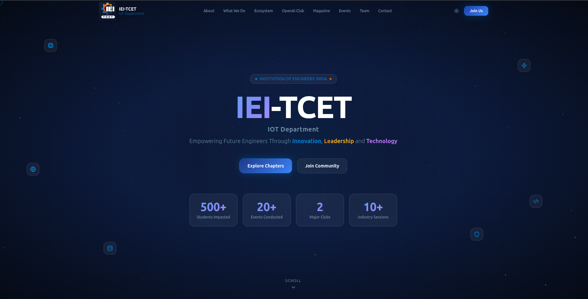
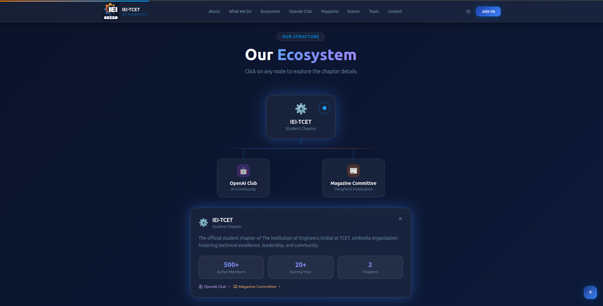
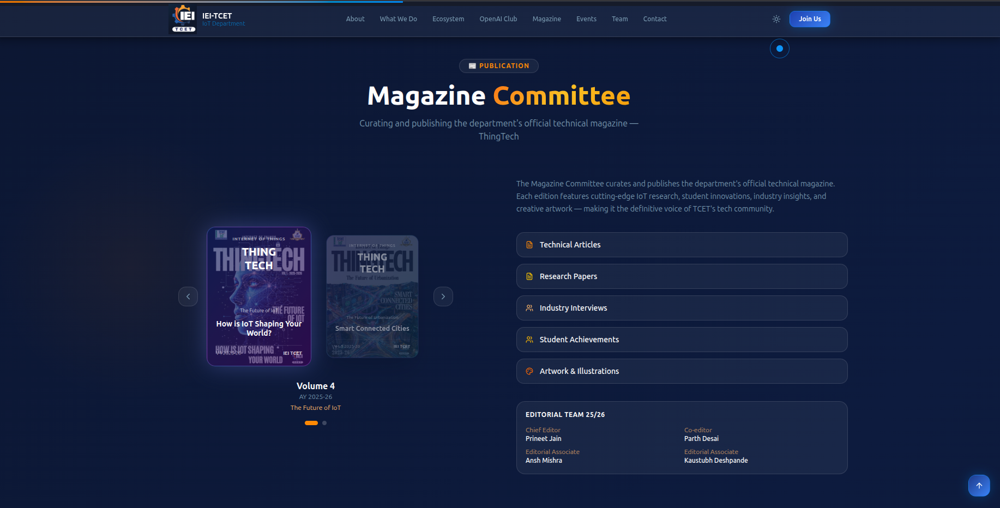
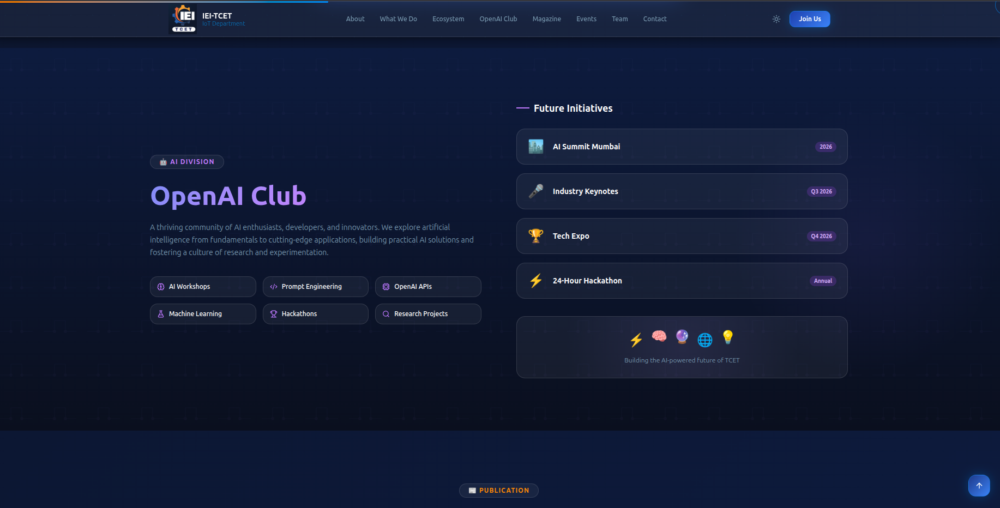
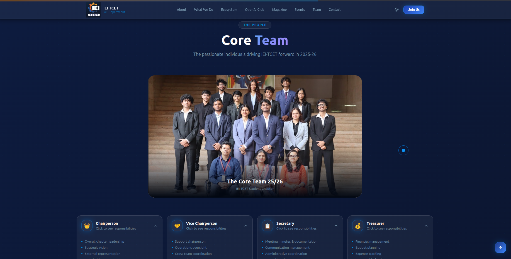
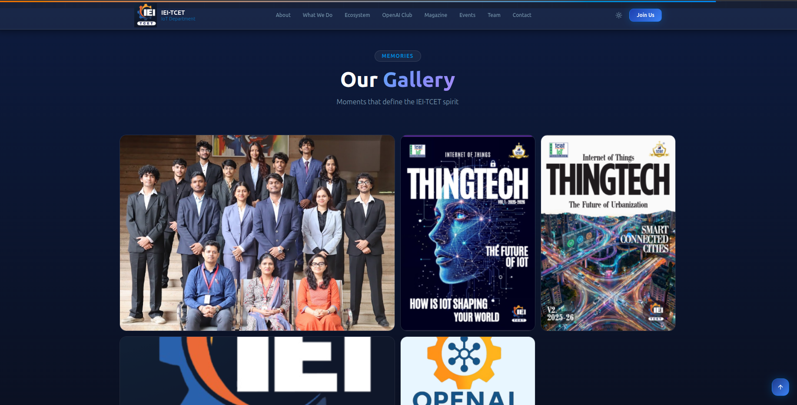

# 🚀 IEI-TCET Website (Frontend Practice Project)

A modern and responsive frontend website inspired by the IEI-TCET student chapter. This project was built for learning and practice purposes to improve skills in React, UI design, animations, and responsive web development.

## 🌐 Live Demo

🔗 https://iei-tcet-website.onrender.com

## 📂 GitHub Repository

🔗 https://github.com/CodeWithShubz/iei-tcet-website

---

## 📖 About The Project

This project is a frontend practice website inspired by the activities and structure of an IEI student chapter website.

The goal of this project was to gain hands-on experience with:

* Modern React development
* Responsive web design
* Component-based architecture
* Smooth animations and transitions
* Professional UI/UX design
* Website deployment on Render

---

## ✨ Features

* 🏠 Modern landing page
* 🎨 Responsive design for desktop and mobile
* 👥 Team section
* 🌐 Ecosystem section
* 🤖 OpenAI Club section
* 📚 Magazine section
* 🖼️ Interactive Gallery section
* ⚡ Smooth animations and transitions
* 🚀 Fast deployment using Render

---

## 🛠️ Technologies Used

* React
* Vite
* TypeScript
* Tailwind CSS
* Framer Motion
* Render

---

## 📸 Screenshots

| Home Page | Ecosystem Section |
|-----------|-------------|
|  |  |

| Magazine Section | OpenAI Club |
|-------------------|-------------|
|  |  |

| Team Section | Gallery Section |
|------------------|-----------------|
|  |  |


---

## 📁 Project Structure

```text
iei-tcet-website/
│
├── public/
├── src/
│   ├── components/
│   ├── assets/
│   ├── pages/
│   └── App.tsx
│
├── screenshots/
│   ├── home.png
│   ├── team.png
│   ├── ecosystem.png
│   ├── openai-club.png
│   ├── magazine-club.png
│   └── gallery.png
│
├── package.json
└── README.md
```

---

## ⚙️ Installation

Clone the repository:

```bash
git clone https://github.com/CodeWithShubz/iei-tcet-website.git
```

Move into the project directory:

```bash
cd iei-tcet-website
```

Install dependencies:

```bash
npm install
```

Start the development server:

```bash
npm run dev
```

Open:

```text
http://localhost:5173
```

---

## 🎯 Learning Outcomes

Through this project, I learned:

* React component architecture
* TypeScript fundamentals
* Tailwind CSS styling
* Framer Motion animations
* Responsive web design
* Project deployment using Render
* Modern frontend development workflow

---

## 🔮 Future Improvements

* Add backend integration
* Dynamic event management
* Admin dashboard
* Authentication system
* Content Management System (CMS)
* Real-time updates

---

## 👨‍💻 Author

**Shubham Tivrekar**

GitHub: https://github.com/CodeWithShubz

---

## ⭐ Note

This project was created for educational and practice purposes only and is not the official website of IEI-TCET.
